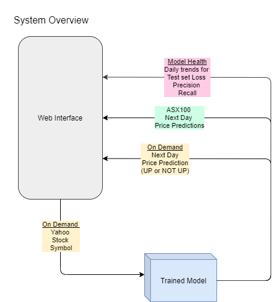

# Stock price movement prediction - Deep Learning

## Introduction

Build a deep learning image classification model to predict stock price movements. The model will be trained using the images of Candlestick charts created with a sliding window of 5 days.

The overall system flow is shown below. 
* When the user enters a Yahoo Stock symbol
    1. The system will retrieve the last 5 days historical price
    2. Create a Candlestick chart 
    3. Use the trained model to predict the price movement for the following day
* The inference process will run daily and show the next day price predictions for the top 100 ASX stock (Australian Stock Exchange)
* System will also show the model performance on the test set generated during the inference process



The project can be broadly divided into three parts :  

I. Training Data Creation [COMPLETED]   
II. Build Models [IN-PROGRESS]   
III. Productionising, Inferencing and User Interface [NOT STARTED]   


## I. Training Data Creation
* The OHLC (Open-High-Low-Close) data for the stocks listed on the Australian Stock Exchange was used to create the candlestick charts (Training set)
* These charts were stored as images along with a target label that indicates whether the stock price moved up or down the following day
* 100_data-exploration.ipynb has the code for creating the datasets and EDA
* Coding notes
    + Used `mplfinance` package to create candlestick charts from OHLC CSV data.         
    + Customisation done using `matplotlib` [rcParams](https://matplotlib.org/3.2.1/tutorials/introductory/customizing.html#customizing-with-matplotlibrc-files)
    + Width adjustments done with help from (https://github.com/matplotlib/mplfinance/blob/master/examples/widths.ipynb)
    + Awesome .ipynb examples here (https://github.com/matplotlib/mplfinance/blob/master/examples)
    + Created RAMDisk for faster read/write of chart image files
    + Used `uint8` for `numpy` arrays and also for `create_dataset` in `h5py` .h5 file creation
    + Used `multiprocessing` pool function to spawn `mp.cpu_count()` simultaneous process


## II. Build Models [IN-PROGRESS]
The overall plan is to use Tensorflow-Keras to try different types of Deep Learning models. Below models have been tried so far without much success
1. Fully Connected Dense Networks
2. Convolutional Neural Networks
3. Transfer Learning

## III. Inferencing and User Interface [NOT STARTED]


***

.  
.  
.  

## Current Status :
* So far, none of the models have been able to give good performance. The main cause is possibly because they are not able to get enough signals and patterns from the training dataset
* Things tried/learnt so far :
    + CNN and Transfer learning using Mobilenet 
    + Learning Rate finder
    + Learning rate decay
    + Weights and Biases website for logging experiments
    + tf.Data for loading datasets larger than RAM
    + Optimisation algorithms : relu, Leaky Relu, Adam 
    + Training data : Image enhancement, Removed outlier images using RGB mean, Increasing dataset size
    + Keras Tuning
    + GPU utilisation fixed
    

## Next Steps :
    + Extract features using Transfer learning and then use Logistic, XGB, RF, SVM, etc
    + Try different optimisation algorithm initialiser parameters
        + HE activation for Relu and Xavier for Adam ?\
        + Change alpha and beta values    
    + Custom loss function
    + L1 regularisation, combined with L2
    + Convolutions with higher strides
    + Outlier detection refine : Separate RGB and then find their means 
    + Anamoly detection in images


.  
.  
.  
.  
.  
.  

## Draft Notes (To be Compiled)


## Tensorflow - GPU setup

* Tensorflow by default allocates entire GPU memory to the running process. This results in a error if you try to run multiple scripts. Fixed using the [this config](https://www.tensorflow.org/guide/gpu)
    ```
    gpus = tf.config.experimental.list_physical_devices('GPU')
    if gpus:
    try:
        # Currently, memory growth needs to be the same across GPUs
        for gpu in gpus:
        tf.config.experimental.set_memory_growth(gpu, True)
        logical_gpus = tf.config.experimental.list_logical_devices('GPU')
        print(len(gpus), "Physical GPUs,", len(logical_gpus), "Logical GPUs")
    except RuntimeError as e:
        # Memory growth must be set before GPUs have been initialized
        print(e)
    ```
* Mixed precision
    + https://www.tensorflow.org/guide/mixed_precision
    + As my GPU is RTX2060 with compute capability of 7.5 I used it
    ```
       from tensorflow.keras.mixed_precision import experimental as mixed_precision
       policy = mixed_precision.Policy('mixed_float16')
       mixed_precision.set_policy(policy)
    ```
    + Did not notice any impact on the performance


## tf.Data 
* Be sure to shard before you use any randomizing operator (such as shuffle).
* Generally it is best if the shard operator is used early in the dataset pipeline. For example, when reading from a set of TFRecord files, shard before converting the dataset to input samples. This avoids reading every file on every worker. The following is an example of an efficient sharding strategy within a complete pipeline:

* By contrast, the buffer_size argument to tf.data.Dataset.shuffle() affects the randomness of the transformation. We designed the Dataset.shuffle() transformation (like the tf.train.shuffle_batch() function that it replaces) to handle datasets that are too large to fit in memory. Instead of shuffling the entire dataset, it maintains a buffer of buffer_size elements, and randomly selects the next element from that buffer (replacing it with the next input element, if one is available). Changing the value of buffer_size affects how uniform the shuffling is: if buffer_size is greater than the number of elements in the dataset, you get a uniform shuffle; if it is 1 then you get no shuffling at all. For very large datasets, a typical "good enough" approach is to randomly shard the data into multiple files once before training, then shuffle the filenames uniformly, and then use a smaller shuffle buffer. However, the appropriate choice will depend on the exact nature of your training job.

## Fully Connected Network Build
+ Increased image size from 64x64 to 191x192 (Lowered underfit)
+ Batch Normalisation (Lower overfit)
    + `,keras.layers.BatchNormalization()`
+ Dropout Regularisation (Lower overfit)
    + `,keras.layers.Dropout(0.5)`
    + rate = keep_probability, lower for higher overfit
+ Activation layers : `kernel_initializer=tf.keras.initializers.` (Lower overfit)
    + he_normal() for `tanh` activations
    + GlorotNormal() for `relu` activations also called Xavier normal initializer
    + Both have normal and uniform versions

* Enabled Single Point precision (FP16) for better performance
* Installed `[tensorboard]`(https://www.tensorflow.org/tensorboard/get_started)
* used hParams 

## Improving Training time
There are many other factors but let us focus mainly on these to improve the Training time.

* Train/Test Split : For large datasets, to reduce the Training time choose the split size to be 0.3 instead of 0.2 or 0.1, in that way the training time reduces by a large factor at the cost of models performance but we will come to that later and see how we can actually do something to create more data while training.
* Learning rate: This factor doesn't really affects the training time but rather I've opted this to just point out that different datasets ask for different learning rates so using a constant value like 0.01 or 0.003 or any other famous learning rate value to train your model won't really help you out you need to try different learning rates for the same dataset time to again unless you find the best convergence but taking into account that if the dataset is too large then trying different learning rate can become very troublesome and time consuming. And for that we have something called reduce lr on plateau. We'll see to that in the next point.
* Reduce lr on plateau - Reduce learning rate when a metric has stopped improving. Models often benefit from reducing the learning rate by a factor of 2-10 once learning stagnates. This callback monitors a quantity and if no improvement is seen for a 'patience' number of epochs, the learning rate is reduced. Giving you a better convergence. You will be able to find this callback function in Keras and Tensorflow.
* Data Augmentation - to get more data, you just need to make minor alterations to our existing dataset. Minor changes such as flips or translations or rotations. Our neural network would think these are distinct images anyway. A convolutional neural network that can robustly classify objects even if its placed in different orientations is said to have the property called invariance.
* Dense Layers - after doing all these you won't be needing to use a number of dense layers in the end and rather the convolutional and maxpooling followed by another convolutional and max pooling and then a dense layer followed by the output layer will be enough to get you an accuracy of above your benchmark and reducing the overall training time.
* Dropout - Increase the dropout from 0.2 to 0.25 for better training time and avoiding over fitting.
* Epochs - reduce the number of epochs to 30–35 for a improvement in training time. That's my ideal number. If that doesn't suits you I'm pretty sure you'll find yours.

Our optimization goal is to chase that sweet spot where our model’s loss is low, which happens when your parameters are tuned in the right way. Thus instead of increasing the number of layers try to set the hyperparameters. Also, the number of parameters you need is proportional to the complexity of the task your model has to perform.

There are other factors like Batch Normalization, Random Sampling , Natural Biases, Feature Scaling, regularization terms but these aren't that very necessary except for feature scaling , you need to do that almost everywhere.


## Some Random Notes on Dropout worsens performance

* Furthermore, be careful where you use dropout. It is usually ineffective in the convolutional layers, and very harmful to use right before the softmax layer.
* Dropout is a regularization technique, and is most effective at preventing overfitting. However, there are several places when dropout can hurt performance.
    + Right before the last layer. This is generally a bad place to apply dropout, because the network has no ability to "correct" errors induced by dropout before the classification happens. If I read correctly, you might have put dropout right before the softmax in the iris MLP.
    + When the network is small relative to the dataset, regularization is usually unnecessary. If the model capacity is already low, lowering it further by adding regularization will hurt performance. I noticed most of your networks were relatively small and shallow.
    + When training time is limited. It's unclear if this is the case here, but if you don't train until convergence, dropout may give worse results. Usually dropout hurts performance at the start of training, but results in the final ''converged'' error being lower. Therefore, if you don't plan to train until convergence, you may not want to use dropout.
    + Finally, I want to mention that as far as I know, dropout is rarely used nowaways, having been supplanted by a technique known as batch normalization. Of course, that's not to say dropout isn't a valid and effective tool to try out.


## Misc
* I also notice that you did not define an activation function for the last layer : keras.layers.Dense(10), if you define the loss a crossentropy you need to get some probability as output of your network, for example keras.layers.Dense(10, activation='softmax')

* Why the initial accuracy is 0 :As your accuracy is pretty low it's highly probable that in a first few batches none of the examples will be classified properly. Especially when you have a small batch. This makes accuracy to be 0 at the beginning of your training.

* Our model has nearly 1 million free parameters but only 60,000 training data points. What should we be worried about? The answer is overfitting. And to help reduce overfitting, we always add dropout. Typically we add dropout after layers that have free parameters: in this case, before the first dense layer, and before the second dense layer. We have set dropout = 40%, but it can be anywhere between 20% and 50%. Our code now looks like this:

* Loss wiggly
    + this is what i expect a validation loss to look like if your validation set is tiny and you’re using a high learning rate
    + Well, I actually save all models (one per epoch) and average three best ones (with harmonic mean, which works better than simple average or geometric mean for some opaque reason) and indeed it gives better results.
    + My volatility problem is solved when i increased the batch size from 16 to 128.

* When using tf.Data, if the shuffle buffer_size is not the same as the number of available samples then the model will get different set of samples after the buffer becomes empty andthe loss plot will become wiggly. 
* **In the earlier CNN experiments, I had not changed the default stride of (1,1). Increasing it to (2,2) allowed quicker conversion**

* The .h5 file sizes are huge 
    + Solved by setting dtypye to uint
    + `file.create_dataset('set_x', data=set_x,dtype='uint8')`
    + 5.4GB reduced to 700MB
    + So far no reduction in model performance (accuracy 60%)

* Also reduced the numpy array that is holding x and y from `int64` to `uint8`
    + `set_xy = (np.empty(shape=(loop_range),dtype = 'uint8')
            ,np.empty(shape=(loop_range,IMG_SIZE,IMG_SIZE,3)))`
    + CRASHED

* Other issues faced as mentioned above :
    + Had to use all the 6 cores using multiprocessing pool
    + Same random number was getting generated when the process was called. I have to pass seed, but couldnt get it to work as passing 3 variables in pool.map / pool.starmap was becoming a challenge
    + Solved by using the Date variable in the file name    
    + Earlier I used 64x64 images but the model seemed to stuck at 50% accuracy. Maybe more epochs would have helped ? not sure


* Tensorflow started giving memory error :
    + `Unable to allocate array with shape (156816, 36, 53806) and data type uint8`
    + Fixed after increasing page size.. not sure how
    + Alternate solution : `echo 1 > /proc/sys/vm/overcommit_memory` [NOT TRIED]
    + Source : https://stackoverflow.com/questions/57507832/unable-to-allocate-array-with-shape-and-data-type


* More memory issues :
    + `print(set_x.dtype)`  gives `uint8` as I have stored the images in that format as it also takes less space but any operation like subtraction and division, converts it to float32 and thus bloating up the space and hence the memory error
    + `print(set_x.nbytes/1024/1024)` gives  3.5GB
    + Solution is 
        + 1. Convert the array to float32 or float16 (but many methods expect float32)
        + Use keras.layers.BatchNormalization()
    + Side note : Types are changing to float due to tf.image.resize_images.


* Initially, the accuracy was stuck at 50%. Below were some of the things that helped in increasing it
    + The objective was to overfit the model i.e get the training accuracy to 99% 
    + Increased the shape of the images from 64x64 to 192x192. Tried other sizes like 
        + 128 (was better than 64)
        + 256 (Was increasing the array size)
        + Settled with 192x192 for now
    + The set_x/255. step was filling up the memory. So used Batch normalisation
    + Increased the training set to over 30K images (out of the available 60K + images)
        + The DATE_WINDOW reduced from 20 to 15

* Reducing Overfitting
    + kernel_regularizer=keras.regularizers.l2(0.001))
    + kernel_initializer='GlorotNormal'
        + Default is GlorotUniform (which is Xavier uniform)
        + According to this course by Andrew Ng and the Xavier documentation, if you are using ReLU as activation function, better change the default weights initializer(which is Xavier uniform) to Xavier normal by
        + Interesting papers linked here : https://stats.stackexchange.com/questions/339054/what-values-should-initial-weights-for-a-relu-network-be
        + If you dug a little bit deeper, you’ve likely also found out that one should use Xavier / Glorot initialization if the activation function is a Tanh, and that He initialization is the recommended one if the activation function is a ReLU. Source: https://towardsdatascience.com/hyper-parameters-in-action-part-ii-weight-initializers-35aee1a28404
    + kernel_initializer=tf.keras.initializers.he_normal()
        +  I will use this


* After adding `keras.layers.BatchNormalization()` after every Relu layer, the accuracy was initially very low as compared to without BN after every layer. But it is gradually increasing
    + After removing BN layers, the val acc for the first epoch increased from 25% to like 49% ????????


* Check memory occupied by int and float dtypes
```import numpy as np
def calcArrayMemorySize(array):
    return "Memory size is : " + str(array.nbytes/1024/1024) + " Mb"
    
print(calcArrayMemorySize(np.random.randint(0,255,size=(100,64,64,3))))
print(calcArrayMemorySize(np.random.random(size=(100,64,64,3))))
print(calcArrayMemorySize(np.random.random_sample(size=(100,64,64,3))))

Something wrong 
#Memory size is : 9.375 Mb
#Memory size is : 9.375 Mb
#Memory size is : 9.375 Mb
```

* Normalising Error
    + `set_x = set_x.astype("float32") / 255`
    + MemoryError: Unable to allocate 24.2 GiB for an array with shape (58842, 192, 192, 3) and data type float32


18th Jul 20
* For using the F1 metrics from tfa (tensorflowaddons), y should be one hot encoded
    + `metrics=['accuracy',tfa.metrics.FBetaScore(num_classes=3, average="micro", threshold=None )]`
    + And use `loss=tf.keras.losses.CategoricalCrossentropy()` 
* Changed class weights using `counts.sum()/counts/2`

